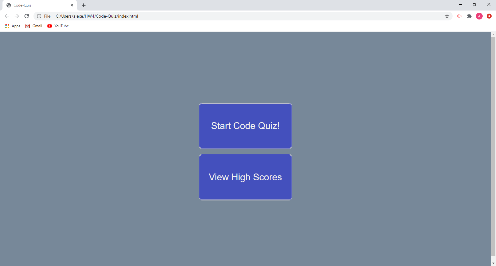

# Code-Quiz

 
<a href="https://alexemrob.github.io/Code-Quiz/">Click to Visit My Page!</a>
  

  

<h3>quiz instructions</h3>

click "start quiz" to begin exam 
  the timer will allow 30 seconds to complete as many questions as possible 
  the questions left unanswered within the 30 seconds will be counted as incorrect 
  upon completion you will recieve your total score 
  add your initials to the text box to compare high scores!

